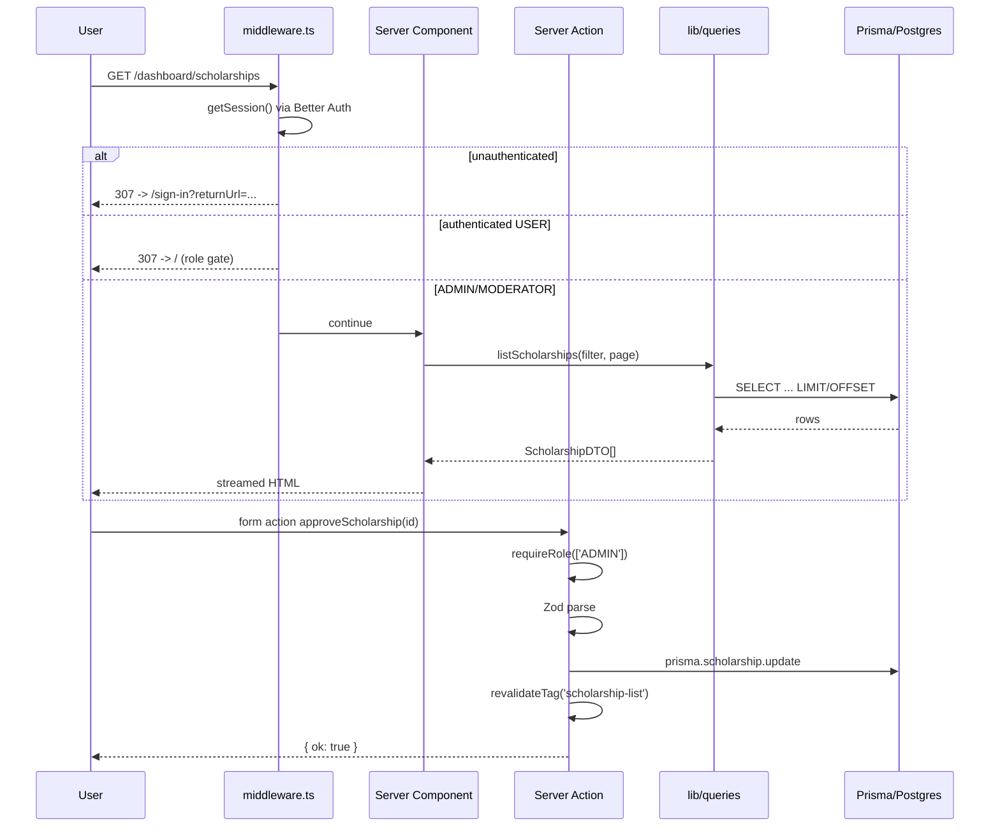
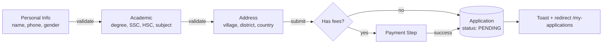
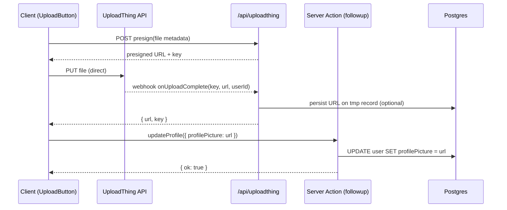

# Design Document

## Overview

ScholarVista is a full-stack scholarship management platform built on Next.js (latest stable, App Router) with TypeScript, Tailwind CSS, and shadcn/ui. The platform is bootstrapped from the [next-js-boilerplate-with-better-auth](https://github.com/SarcasticSphinx/next-js-boilerplate-with-better-auth) and renamed end-to-end from "HomeX"/"homex-crm" to "ScholarVista"/"scholar-vista".

The system serves three role personas (USER, MODERATOR, ADMIN) with distinct capabilities backed by Better Auth (email/password + Google OAuth). Domain data is stored in PostgreSQL on NeonDB, accessed through Prisma ORM. Images flow through UploadThing. Forms use React Hook Form with Zod, and toasts are rendered with Sonner. Theming is handled via next-themes. Charts on the dashboard use Recharts.

The design favors React Server Components for data-bound pages, Server Actions for write paths, and thin client components only where interactivity (forms, dropdowns, toggles, charts, theme switching) is required.

### Design Goals

- **Type safety end-to-end**: shared Zod schemas, generated Prisma types, typed Server Actions.
- **Server-first rendering**: SSR/RSC for all public catalog pages and dashboard pages to maximize SEO and minimize client JS.
- **Auth-aware routing**: middleware-driven route protection with role-based access derived from a single session source of truth.
- **Predictable data flow**: queries colocated under `lib/queries/*`, mutations under `actions/*`, Zod schemas under `lib/validation/*`.
- **Accessible by default**: shadcn/ui primitives are Radix-based, satisfying WAI-ARIA 1.2; theme tokens enforce WCAG AA contrast.
- **Performance budget**: Lighthouse mobile ≥80, route-level code splitting for any bundle ≥50KB.

### Research Notes

- **Better Auth** (>=1.x) provides first-class Next.js support via `@better-auth/cli` for schema generation and a `nextCookies()` plugin for cookie-based session handling in App Router/Server Actions. Email/password is configured via `emailAndPassword: { enabled: true }`. Google OAuth via `socialProviders.google`. Source: [better-auth.com/docs](https://www.better-auth.com/docs/integrations/next).
- **Next.js 15 App Router** caching defaults changed: fetches are no longer cached by default. Use `unstable_cache` with explicit tags or `revalidate` exports for ISR-style behavior. Use `revalidatePath`/`revalidateTag` after Server Action mutations.
- **UploadThing v7+** ships a Next.js App Router adapter (`createRouteHandler`) and React helpers (`UploadButton`, `UploadDropzone`) with built-in MIME/size validation hooks.
- **Prisma 5+** supports `Decimal` for monetary fields, `@@unique` composite constraints, and `onDelete: Cascade` on relations - all required by the schema.

---

## Architecture

### High-Level Architecture

```mermaid
graph TB
    subgraph Client["Client Browser"]
        UI[React UI<br/>RSC + Client Components]
        Theme[next-themes]
        LS[Local Storage<br/>Comparison Cart]
    end

    subgraph NextApp["Next.js App Router"]
        MW[middleware.ts<br/>Session + Role Gate]
        RSC[Server Components<br/>app/**/page.tsx]
        SA[Server Actions<br/>actions/**]
        API[Route Handlers<br/>app/api/**]
        AuthRH[Better Auth Handler<br/>app/api/auth/[...all]]
        UTRH[UploadThing Handler<br/>app/api/uploadthing]
    end

    subgraph Lib["lib/"]
        AuthLib[auth.ts<br/>Better Auth instance]
        AuthClient[auth-client.ts]
        PrismaClient[prisma.ts<br/>singleton]
        Queries[queries/*]
        Validation[validation/*<br/>Zod schemas]
        Cache[unstable_cache<br/>tag-based]
    end

    subgraph External["External Services"]
        DB[(NeonDB<br/>PostgreSQL)]
        UT[UploadThing CDN]
        Google[Google OAuth]
    end

    UI -->|Form submit| SA
    UI -->|fetch| API
    UI <-->|navigate| RSC
    Theme --> UI
    LS --> UI

    MW --> RSC
    MW --> SA
    MW --> API

    RSC --> Queries
    SA --> Queries
    SA --> Validation
    API --> Queries
    API --> Validation

    AuthRH --> AuthLib
    UTRH --> UT
    AuthLib --> PrismaClient
    AuthLib --> Google
    Queries --> PrismaClient
    Queries --> Cache
    PrismaClient --> DB
```

### Folder Structure

```
scholar-vista/
├── app/
│   ├── (public)/                    # Public, server-rendered routes
│   │   ├── page.tsx                 # Home
│   │   ├── scholarships/
│   │   │   ├── page.tsx             # Browse + search
│   │   │   └── [id]/page.tsx        # Detail
│   │   ├── universities/
│   │   │   ├── page.tsx
│   │   │   └── [id]/page.tsx
│   │   ├── compare/page.tsx
│   │   ├── guide/page.tsx
│   │   ├── help/page.tsx
│   │   └── layout.tsx               # Public shell (Navbar/Footer)
│   ├── (auth)/                      # Auth flows
│   │   ├── sign-in/page.tsx
│   │   ├── sign-up/page.tsx
│   │   ├── change-password/page.tsx
│   │   └── layout.tsx               # Centered card layout
│   ├── (authenticated)/             # Authed user routes
│   │   ├── profile/page.tsx
│   │   ├── my-applications/page.tsx
│   │   ├── my-bookmarks/page.tsx
│   │   ├── my-reviews/page.tsx
│   │   ├── notifications/page.tsx
│   │   ├── scholarships/
│   │   │   ├── new/page.tsx         # User-submitted scholarship
│   │   │   └── [id]/apply/page.tsx  # Multi-step application
│   │   └── layout.tsx
│   ├── (dashboard)/                 # Admin/Moderator
│   │   ├── dashboard/
│   │   │   ├── page.tsx
│   │   │   ├── scholarships/...
│   │   │   ├── universities/...
│   │   │   ├── applications/...
│   │   │   ├── approvals/page.tsx
│   │   │   ├── users/...
│   │   │   ├── reports/page.tsx
│   │   │   ├── settings/page.tsx
│   │   │   └── help/page.tsx
│   │   └── layout.tsx               # Sidebar + Topbar
│   ├── api/
│   │   ├── auth/[...all]/route.ts   # Better Auth handler
│   │   ├── uploadthing/
│   │   │   ├── core.ts              # FileRouter
│   │   │   └── route.ts
│   │   └── webhooks/
│   │       └── payment/route.ts     # Payment provider webhook
│   ├── sitemap.ts                   # Dynamic sitemap
│   ├── robots.ts                    # Robots policy
│   ├── manifest.ts                  # PWA manifest (optional)
│   ├── error.tsx                    # Route error boundary
│   ├── global-error.tsx             # Top-level error boundary
│   ├── not-found.tsx                # Custom 404
│   ├── layout.tsx                   # Root layout (theme + providers)
│   └── globals.css                  # Tailwind layers + tokens
├── components/
│   ├── ui/                          # shadcn/ui primitives
│   ├── layout/                      # Navbar, Footer, Sidebar, ThemeToggle
│   ├── scholarship/                 # ScholarshipCard, FilterBar, etc.
│   ├── university/
│   ├── dashboard/                   # Charts, DataTable, StatCards
│   ├── forms/                       # ApplicationForm, ScholarshipForm
│   └── shared/                      # Pagination, EmptyState, Skeletons
├── actions/                         # Server Actions (mutations)
│   ├── scholarship.ts
│   ├── application.ts
│   ├── bookmark.ts
│   ├── review.ts
│   ├── university.ts
│   ├── user.ts
│   ├── notification.ts
│   ├── settings.ts
│   └── payment.ts
├── lib/
│   ├── auth.ts                      # Better Auth server instance
│   ├── auth-client.ts               # Better Auth client SDK
│   ├── prisma.ts                    # Prisma singleton
│   ├── uploadthing.ts               # UT helpers
│   ├── queries/                     # Read-only DB access
│   │   ├── scholarship.ts
│   │   ├── university.ts
│   │   ├── application.ts
│   │   ├── user.ts
│   │   ├── notification.ts
│   │   └── stats.ts
│   ├── validation/                  # Zod schemas (shared)
│   │   ├── scholarship.ts
│   │   ├── application.ts
│   │   ├── university.ts
│   │   ├── user.ts
│   │   ├── review.ts
│   │   └── settings.ts
│   ├── rbac.ts                      # Role helpers (assertRole)
│   ├── cache.ts                     # unstable_cache wrappers + tags
│   ├── seo.ts                       # buildMetadata helpers
│   ├── intl.ts                      # Intl.* formatters
│   ├── messages/en.json             # i18n strings (English default)
│   └── utils.ts                     # cn(), env, etc.
├── hooks/
│   ├── use-comparison.ts            # localStorage-backed comparison cart
│   ├── use-debounced-value.ts
│   └── use-pagination.ts
├── types/
│   ├── auth.ts                      # Augmented Session/User
│   └── api.ts                       # Action result types
├── prisma/
│   ├── schema.prisma
│   └── migrations/
├── messages/                        # i18n locale files
│   └── en.json
├── public/
├── middleware.ts                    # Auth + role-based gate
├── next.config.ts
├── tailwind.config.ts
├── components.json                  # shadcn/ui config
├── eslint.config.mjs
├── tsconfig.json
├── .env.example
└── package.json
```

### Request Lifecycle



---

## Components and Interfaces

### Authentication Layer

**Better Auth server instance** (`lib/auth.ts`):

```ts
import { betterAuth } from "better-auth";
import { prismaAdapter } from "better-auth/adapters/prisma";
import { nextCookies } from "better-auth/next-js";
import { prisma } from "@/lib/prisma";

export const auth = betterAuth({
  database: prismaAdapter(prisma, { provider: "postgresql" }),
  emailAndPassword: {
    enabled: true,
    minPasswordLength: 8,
    maxPasswordLength: 128,
  },
  socialProviders: {
    google: {
      clientId: process.env.GOOGLE_CLIENT_ID!,
      clientSecret: process.env.GOOGLE_CLIENT_SECRET!,
    },
  },
  user: {
    additionalFields: {
      role: { type: "string", defaultValue: "USER", input: false },
      profilePicture: { type: "string", required: false },
      educationalLevel: { type: "string", required: false },
      major: { type: "string", required: false },
      country: { type: "string", required: false },
      city: { type: "string", required: false },
      dateOfBirth: { type: "date", required: false },
    },
  },
  plugins: [nextCookies()],
});

export type Session = typeof auth.$Infer.Session;
```

**Better Auth handler** (`app/api/auth/[...all]/route.ts`):

```ts
import { auth } from "@/lib/auth";
import { toNextJsHandler } from "better-auth/next-js";
export const { GET, POST } = toNextJsHandler(auth);
```

**Client SDK** (`lib/auth-client.ts`):

```ts
import { createAuthClient } from "better-auth/react";
export const authClient = createAuthClient({
  baseURL: process.env.NEXT_PUBLIC_APP_URL,
});
export const { signIn, signOut, signUp, useSession } = authClient;
```

### Middleware (Edge)

`middleware.ts` is responsible for cheap route gating only - it checks the session cookie, not the database. Heavy authorization (role-based) happens in layouts/pages/Server Actions where `auth.api.getSession()` runs in Node.

```ts
import { NextRequest, NextResponse } from "next/server";
import { getSessionCookie } from "better-auth/cookies";

const PROTECTED = [
  /^\/profile/, /^\/change-password/, /^\/my-applications/,
  /^\/my-bookmarks/, /^\/my-reviews/, /^\/notifications/,
  /^\/scholarships\/[^/]+\/apply/, /^\/scholarships\/new/,
  /^\/dashboard/,
];

export function middleware(req: NextRequest) {
  const { pathname } = req.nextUrl;
  if (!PROTECTED.some((re) => re.test(pathname))) return NextResponse.next();
  const session = getSessionCookie(req);
  if (!session) {
    const url = new URL("/sign-in", req.url);
    url.searchParams.set("returnUrl", pathname + req.nextUrl.search);
    return NextResponse.redirect(url);
  }
  return NextResponse.next();
}

export const config = { matcher: ["/((?!_next/|api/auth|favicon).*)"] };
```

Role enforcement runs server-side in dashboard layout:

```ts
// app/(dashboard)/layout.tsx
import { headers } from "next/headers";
import { redirect } from "next/navigation";
import { auth } from "@/lib/auth";

export default async function DashboardLayout({ children }) {
  const session = await auth.api.getSession({ headers: await headers() });
  if (!session) redirect("/sign-in?returnUrl=/dashboard");
  if (!["ADMIN", "MODERATOR"].includes(session.user.role)) redirect("/");
  return <DashboardShell user={session.user}>{children}</DashboardShell>;
}
```

### RBAC Helper (`lib/rbac.ts`)

```ts
import { auth } from "@/lib/auth";
import { headers } from "next/headers";

export async function requireSession() {
  const s = await auth.api.getSession({ headers: await headers() });
  if (!s) throw new Error("UNAUTHORIZED");
  return s;
}

export async function requireRole(roles: Array<"USER" | "MODERATOR" | "ADMIN">) {
  const s = await requireSession();
  if (!roles.includes(s.user.role)) throw new Error("FORBIDDEN");
  return s;
}
```

### Server Actions vs Route Handlers

| Concern | Choice | Rationale |
|---|---|---|
| Form mutations (apply, bookmark toggle, review, profile update, admin CRUD) | **Server Action** | Type-safe, progressive enhancement, simplifies CSRF (cookie-bound), composes with `revalidatePath`/`revalidateTag`. |
| Better Auth endpoints | **Route Handler** | Required by Better Auth (`[...all]`). |
| UploadThing | **Route Handler** | Required by UT adapter. |
| Payment provider webhook | **Route Handler** | External system signs requests; needs raw body. |
| Image upload completion callback | **Route Handler** (UT `onUploadComplete`) | Server-side persistence after CDN upload. |
| RSC data reads | **Direct Prisma in `lib/queries`** | No HTTP overhead; Server Components fetch directly. |

Standard Server Action result shape:

```ts
type ActionResult<T = void> =
  | { ok: true; data: T }
  | { ok: false; error: { code: string; message: string; fieldErrors?: Record<string, string[]> } };
```

### Data Fetching & Caching

**Strategy:**

- Public catalog pages (home, scholarships list, universities list) wrap their query in `unstable_cache` with tags so mutations can target invalidation.
- Scholarship detail and university detail use `revalidate = 60` (ISR) keyed on the `[id]` segment.
- Dashboard pages opt out of caching (`export const dynamic = "force-dynamic"`) - fresh data per admin view.
- Authenticated user pages (my-applications, my-bookmarks) are dynamic per user; never cached.

```ts
// lib/cache.ts
import { unstable_cache } from "next/cache";

export const CACHE_TAGS = {
  scholarshipList: "scholarship-list",
  scholarshipDetail: (id: string) => `scholarship:${id}`,
  universityList: "university-list",
  homeStats: "home-stats",
  partnerUnis: "partner-universities",
} as const;

export const REVALIDATE = {
  scholarshipList: 60,   // Req 25.5
  universityList: 300,   // Req 25.5
  homeStats: 120,
} as const;

export const cached = <T extends (...a: any[]) => any>(fn: T, key: string[], opts: { tags?: string[]; revalidate?: number }) =>
  unstable_cache(fn, key, opts);
```

After mutations, Server Actions call `revalidateTag(CACHE_TAGS.scholarshipList)` (or path) before returning.

### Component Architecture

**Server Components (default):**
- All `page.tsx` and `layout.tsx` files.
- `ScholarshipList`, `ScholarshipCard`, `UniversityCard`, `StatsGrid`, `RelatedScholarships`, dashboard data tables (rendered server-side, hydrated only for sorting where required).
- Loading shells via `loading.tsx` per route segment for streamed Suspense.

**Client Components (`"use client"`):**
- `ThemeToggle`, `Navbar` (mobile menu state), `FilterBar` (URL sync), `SortSelect`, `Pagination` (focus management).
- `ApplicationFormStepper`, `ScholarshipForm`, `UniversityForm`, `ProfileForm` (RHF + Zod).
- `BookmarkButton`, `CompareButton`, `ComparisonTray` (localStorage).
- `NotificationBell`, `Toaster` (Sonner).
- All chart components (Recharts is client-only).
- `UploadButton`/`UploadDropzone` from UploadThing.

**Composition pattern:** server-rendered card with islands of interactivity:

```tsx
// components/scholarship/scholarship-card.tsx (server)
export function ScholarshipCard({ s, isBookmarked }: Props) {
  return (
    <article className="rounded-xl border ...">
      <Link href={`/scholarships/${s.id}`}>...</Link>
      <BookmarkButton scholarshipId={s.id} initial={isBookmarked} />
      <CompareButton scholarship={s} />
    </article>
  );
}
```

### Form Validation Pattern

Single source of truth Zod schemas live in `lib/validation/*` and are imported by both the client (RHF resolver) and the Server Action (parse on the server).

```ts
// lib/validation/application.ts
import { z } from "zod";

export const ApplicationSchema = z.object({
  applicantName: z.string().min(2).max(100),
  phone: z.string().regex(/^\+?\d{7,15}$/),
  gender: z.enum(["MALE", "FEMALE", "OTHER"]),
  applyingDegree: z.enum(["UNDERGRADUATE", "MASTERS", "PHD", "POSTDOC"]),
  sscResult: z.coerce.number().min(0).max(5),
  hscResult: z.coerce.number().min(0).max(5),
  subjectCategory: z.string().min(1).max(100),
  village: z.string().max(100),
  district: z.string().max(100),
  country: z.string().max(100),
});
export type ApplicationInput = z.infer<typeof ApplicationSchema>;
```

```tsx
// components/forms/application-form.tsx (client)
"use client";
const form = useForm<ApplicationInput>({ resolver: zodResolver(ApplicationSchema) });
const onSubmit = async (values: ApplicationInput) => {
  const res = await submitApplicationAction(scholarshipId, values);
  if (!res.ok) {
    if (res.error.fieldErrors) Object.entries(res.error.fieldErrors).forEach(([k, v]) => form.setError(k as any, { message: v[0] }));
    else toast.error(res.error.message);
  } else { toast.success("Application submitted"); router.push("/my-applications"); }
};
```

```ts
// actions/application.ts
"use server";
export async function submitApplicationAction(scholarshipId: string, raw: unknown) {
  const session = await requireRole(["USER","MODERATOR","ADMIN"]);
  const parsed = ApplicationSchema.safeParse(raw);
  if (!parsed.success) return { ok: false, error: { code: "VALIDATION", message: "Invalid input", fieldErrors: parsed.error.flatten().fieldErrors } };
  // duplicate check + insert
}
```

### Multi-Step Application Form (3 sections)



State is held in the client (`useForm` per step or single root form). Each step uses `form.trigger(stepFields)` to gate progression. Submission is one Server Action call carrying the merged state.

### Image Upload Flow (UploadThing)



`app/api/uploadthing/core.ts` defines three FileRoutes:

```ts
export const ourFileRouter = {
  profileImage: f({ image: { maxFileSize: "5MB", maxFileCount: 1 } })
    .middleware(async ({ req }) => {
      const session = await auth.api.getSession({ headers: req.headers });
      if (!session) throw new UploadThingError("UNAUTHORIZED");
      return { userId: session.user.id };
    })
    .onUploadComplete(async ({ metadata, file }) => ({ url: file.url, userId: metadata.userId })),

  scholarshipImage: f({ image: { maxFileSize: "5MB", maxFileCount: 1 } })
    .middleware(async ({ req }) => {
      const s = await auth.api.getSession({ headers: req.headers });
      if (!s) throw new UploadThingError("UNAUTHORIZED");
      return { userId: s.user.id };
    })
    .onUploadComplete(async ({ file }) => ({ url: file.url })),

  universityLogo: f({ image: { maxFileSize: "5MB", maxFileCount: 1 } })
    .middleware(async ({ req }) => {
      const s = await auth.api.getSession({ headers: req.headers });
      if (!s || !["ADMIN","MODERATOR"].includes(s.user.role)) throw new UploadThingError("FORBIDDEN");
      return { userId: s.user.id };
    })
    .onUploadComplete(async ({ file }) => ({ url: file.url })),
} satisfies FileRouter;
```

Replacement (Req 26.6) is handled by the entity-update Server Action: when a new URL arrives, it overwrites the old field. Old keys can be reaped by a scheduled cleanup job using `utapi.deleteFiles`.

### Theme System

`app/layout.tsx`:

```tsx
<html lang="en" suppressHydrationWarning>
  <body>
    <ThemeProvider attribute="class" defaultTheme="system" enableSystem disableTransitionOnChange>
      {children}
      <Toaster richColors position="top-right" />
    </ThemeProvider>
  </body>
</html>
```

`next-themes` writes the resolved theme class onto `<html>` before paint via its inline script (Req 22.5). `disableTransitionOnChange` keeps the toggle within 100ms (Req 22.2). Tokens (CSS variables) are defined in `globals.css` for `light` and `dark` with contrast-checked values for AA (Req 22.6, 27.4). RTL support uses `dir` on `<html>` driven by locale config (Req 32.3).

### SEO Strategy

- **Per-route metadata** via `generateMetadata` for dynamic pages and exported `metadata` for static pages.
- **Helper** `lib/seo.ts` exports `buildMetadata({ title, description, path, image })` enforcing 60/160 char limits, OG and Twitter Card tags, and canonical URL.
- **JSON-LD** for scholarship detail pages emitted via `<script type="application/ld+json">` rendered server-side using Schema.org `Scholarship` type.
- **Sitemap** (`app/sitemap.ts`) queries Prisma for all `isApproved=true` scholarships and all universities; revalidated when scholarships are approved/removed via `revalidateTag('sitemap')`.
- **Robots** (`app/robots.ts`) returns rules disallowing `/dashboard`, `/profile`, `/my-*`, `/notifications`, `/api/*`.

### Notifications

- Database-backed `Notification` rows produced by Server Actions on triggering events (status change, approval, payment).
- Header `NotificationBell` (client) polls a Server Action every 60s (or uses `useSWR` against a thin `/api/notifications/unread-count` route) for the unread badge.
- Notifications dropdown lazily loads the latest 20 via Server Action on open.
- Marking-read mutations use Server Actions and `revalidatePath('/notifications')` plus broadcast to bell via `router.refresh()`.

### Payment Processing

- Provider-agnostic seam: `lib/payment/provider.ts` exposes `createCheckout({ amount, applicationId })` returning a redirect URL plus a 30-min expiry token. Reference implementation targets Stripe Checkout.
- Flow: user submits application form → if `scholarship.fees > 0`, Server Action creates a `Payment` row with status `UNPAID` and a transient `expiresAt`, returns checkout URL; client redirects to provider; provider posts back to `/api/webhooks/payment` which verifies the signature, updates `Payment` and the linked `Application` (`paymentStatus = PAID`, `status = PENDING`).
- Expiry job: lightweight cron (Vercel Cron or DB scan on next access) marks `Payment` `EXPIRED` when `expiresAt < now()` and not `PAID`.

### Comparison Tray (localStorage)

`hooks/use-comparison.ts` exposes `{ items, add, remove, clear, isFull }` backed by `localStorage` under key `sv:compare:v1`. Min 2, max 3. Floating button hidden until count ≥ 2. The `/compare` page is a Client Component that hydrates from localStorage and fetches missing scholarships by id via a Server Action returning `Promise<ScholarshipDTO[]>`. Missing attribute values render as `"-"`.

### Performance Optimization

- **Images**: `next/image` everywhere with `priority` for the hero/LCP element and `sizes` for responsive layouts. `next.config.ts` allows the UploadThing CDN host in `images.remotePatterns`.
- **Code splitting**: Charts (Recharts), comparison page, and admin reports lazy-loaded with `next/dynamic` and a Skeleton fallback - their bundles routinely exceed 50KB.
- **Streaming**: each route segment exports `loading.tsx` rendering shell skeletons so RSC streams progressively.
- **DB indexes**: declared in schema (see Data Models §Indexes).
- **No client JS for static surfaces**: catalog cards remain RSC; only buttons (bookmark/compare) are islands.

### Error Handling

- `app/error.tsx` renders user-facing error UI for each route segment with a "Try again" button calling `reset()`.
- `app/global-error.tsx` provides a fallback for root-level errors (must include `<html>`/`<body>`).
- `app/not-found.tsx` for 404s including from `notFound()` calls in detail pages when an entity is missing or unapproved.
- Server Actions never throw to the client; they return `ActionResult` with a typed `code`/`message`/`fieldErrors`. The client maps known codes to toasts/inline errors.
- API routes return standard HTTP errors: 401 for missing/invalid session, 403 for role mismatch, 503 with `Retry-After: 30` if the database is unreachable (caught from Prisma's known errors).

### Internationalization Readiness

- `messages/en.json` is the default catalog; consumed by a tiny `t(key)` helper in `lib/intl.ts` (no runtime framework yet, but ready for `next-intl` later).
- Date/number formatting via `Intl.DateTimeFormat`/`Intl.NumberFormat`, locale parameter defaults to `"en-US"`.
- Root `<html dir>` is sourced from a locale config function so RTL flips with one toggle when an RTL locale is added.

---

## Data Models

### Prisma Schema

```prisma
// prisma/schema.prisma
generator client {
  provider = "prisma-client-js"
}

datasource db {
  provider = "postgresql"
  url      = env("DATABASE_URL")
}

// ---------- Enums ----------

enum UserRole {
  ADMIN
  MODERATOR
  USER
}

enum ScholarshipCategory {
  UNDERGRADUATE
  MASTERS
  PHD
  POSTDOC
  EXCHANGE
  SHORT_COURSE
}

enum UniversityType {
  PUBLIC
  PRIVATE
  COMMUNITY
}

enum Gender {
  MALE
  FEMALE
  OTHER
}

enum ApplyingDegree {
  UNDERGRADUATE
  MASTERS
  PHD
  POSTDOC
}

enum ApplicationStatus {
  PENDING
  PROCESSING
  COMPLETED
  REJECTED
}

enum PaymentStatus {
  UNPAID
  PAID
  REFUNDED
  FAILED
  EXPIRED
}

enum NotificationType {
  APPLICATION_STATUS_CHANGE
  SCHOLARSHIP_APPROVED
  PAYMENT_CONFIRMED
}

// ---------- Better Auth core (extended) ----------

model User {
  id               String    @id @default(cuid())
  email            String    @unique
  emailVerified    Boolean   @default(false)
  name             String
  image            String?
  // Extensions for ScholarVista
  role             UserRole  @default(USER)
  profilePicture   String?
  educationalLevel String?
  major            String?
  country          String?
  city             String?
  dateOfBirth      DateTime?
  createdAt        DateTime  @default(now())
  updatedAt        DateTime  @updatedAt

  sessions         Session[]
  accounts         Account[]
  postedScholarships Scholarship[]   @relation("PostedBy")
  applications     Application[]
  reviews          Review[]
  bookmarks        Bookmark[]
  payments         Payment[]
  notifications    Notification[]

  @@index([role])
}

model Session {
  id        String   @id
  userId    String
  expiresAt DateTime
  token     String   @unique
  ipAddress String?
  userAgent String?
  createdAt DateTime @default(now())
  updatedAt DateTime @updatedAt
  user      User     @relation(fields: [userId], references: [id], onDelete: Cascade)

  @@index([userId])
}

model Account {
  id                    String   @id
  userId                String
  accountId             String
  providerId            String
  accessToken           String?
  refreshToken          String?
  idToken               String?
  accessTokenExpiresAt  DateTime?
  refreshTokenExpiresAt DateTime?
  scope                 String?
  password              String?
  createdAt             DateTime @default(now())
  updatedAt             DateTime @updatedAt
  user                  User     @relation(fields: [userId], references: [id], onDelete: Cascade)

  @@unique([providerId, accountId])
  @@index([userId])
}

model Verification {
  id         String   @id
  identifier String
  value      String
  expiresAt  DateTime
  createdAt  DateTime @default(now())
  updatedAt  DateTime @updatedAt

  @@index([identifier])
}

// ---------- Domain models ----------

model University {
  id                    String         @id @default(cuid())
  name                  String         @db.VarChar(200)
  logo                  String?
  contactEmail          String         @db.VarChar(254)
  website               String         @db.VarChar(500)
  description           String         @db.VarChar(3000)
  address               String         @db.VarChar(300)
  country               String         @db.VarChar(100)
  city                  String         @db.VarChar(100)
  worldRank             Int
  type                  UniversityType
  establishedYear       Int
  isPartner             Boolean        @default(false)
  acceptingApplications Boolean        @default(true)
  createdAt             DateTime       @default(now())
  updatedAt             DateTime       @updatedAt

  scholarships          Scholarship[]

  @@index([country])
  @@index([isPartner])
  @@index([name])
}

model Scholarship {
  id              String              @id @default(cuid())
  title           String              @db.VarChar(200)
  universityId    String
  university      University          @relation(fields: [universityId], references: [id], onDelete: Restrict)
  category        ScholarshipCategory
  subject         String              @db.VarChar(100)
  description     String              @db.VarChar(5000)
  stipend         Decimal             @db.Decimal(11, 2)
  coverage        String              @db.VarChar(500)
  location        String              @db.VarChar(200)
  requirements    String              @db.VarChar(3000)
  deadline        DateTime
  applicationLink String              @db.VarChar(500)
  fees            Decimal             @db.Decimal(8, 2)
  image           String?
  isApproved      Boolean             @default(false)
  postedById      String
  postedBy        User                @relation("PostedBy", fields: [postedById], references: [id], onDelete: Cascade)
  createdAt       DateTime            @default(now())
  updatedAt       DateTime            @updatedAt

  applications    Application[]
  reviews         Review[]
  bookmarks       Bookmark[]
  payments        Payment[]

  @@index([universityId])
  @@index([category])
  @@index([deadline])
  @@index([isApproved, createdAt])
  @@index([postedById])
}

model Application {
  id              String            @id @default(cuid())
  userId          String
  user            User              @relation(fields: [userId], references: [id], onDelete: Cascade)
  scholarshipId   String
  scholarship     Scholarship       @relation(fields: [scholarshipId], references: [id], onDelete: Cascade)
  applicantName   String            @db.VarChar(150)
  phone           String            @db.VarChar(20)
  gender          Gender
  applyingDegree  ApplyingDegree
  sscResult       String            @db.VarChar(20)
  hscResult       String            @db.VarChar(20)
  subjectCategory String            @db.VarChar(100)
  village         String            @db.VarChar(200)
  district        String            @db.VarChar(100)
  country         String            @db.VarChar(100)
  status          ApplicationStatus @default(PENDING)
  paymentStatus   PaymentStatus     @default(UNPAID)
  feedback        String?           @db.VarChar(1000)
  createdAt       DateTime          @default(now())
  updatedAt       DateTime          @updatedAt

  @@unique([userId, scholarshipId])
  @@index([scholarshipId])
  @@index([status])
  @@index([createdAt])
}

model Review {
  id            String      @id @default(cuid())
  userId        String
  user          User        @relation(fields: [userId], references: [id], onDelete: Cascade)
  scholarshipId String
  scholarship   Scholarship @relation(fields: [scholarshipId], references: [id], onDelete: Cascade)
  ratingPoint   Int         // 1..5 enforced in app + CHECK constraint via raw migration
  comment       String      @db.VarChar(2000)
  createdAt     DateTime    @default(now())

  @@unique([userId, scholarshipId])
  @@index([scholarshipId])
}

model Payment {
  id            String        @id @default(cuid())
  userId        String
  user          User          @relation(fields: [userId], references: [id], onDelete: Cascade)
  scholarshipId String
  scholarship   Scholarship   @relation(fields: [scholarshipId], references: [id], onDelete: Cascade)
  applicationId String?       @unique
  amount        Decimal       @db.Decimal(8, 2)
  transactionId String        @unique @db.VarChar(100)
  paymentStatus PaymentStatus
  expiresAt     DateTime?
  createdAt     DateTime      @default(now())

  @@index([userId])
  @@index([scholarshipId])
}

model Notification {
  id              String           @id @default(cuid())
  userId          String
  user            User             @relation(fields: [userId], references: [id], onDelete: Cascade)
  message         String           @db.VarChar(500)
  type            NotificationType
  isRead          Boolean          @default(false)
  relatedEntityId String?
  createdAt       DateTime         @default(now())

  @@index([userId, isRead, createdAt])
}

model Bookmark {
  id            String      @id @default(cuid())
  userId        String
  user          User        @relation(fields: [userId], references: [id], onDelete: Cascade)
  scholarshipId String
  scholarship   Scholarship @relation(fields: [scholarshipId], references: [id], onDelete: Cascade)
  createdAt     DateTime    @default(now())

  @@unique([userId, scholarshipId])
  @@index([userId])
}

model PlatformSettings {
  id                          String   @id @default("singleton")
  platformName                String   @db.VarChar(100)
  platformDescription         String   @db.VarChar(500)
  featureUserSubmittedEnabled Boolean  @default(true)
  featurePaymentEnabled       Boolean  @default(true)
  updatedAt                   DateTime @updatedAt
}
```

### Notes on Schema Decisions

- **Decimal precision**: `stipend Decimal(11, 2)` accommodates 0.00 to 999,999,999.99 (Req 2.3). `fees`/`amount` use `Decimal(8, 2)` for 0.00 to 999,999.99 (Req 2.3, 2.7).
- **CHECK constraints** (`ratingPoint BETWEEN 1 AND 5`, `worldRank BETWEEN 1 AND 30000`, `establishedYear BETWEEN 1000 AND EXTRACT(YEAR FROM NOW())`) are added via a follow-up raw SQL migration since Prisma does not yet emit CHECK syntax natively. App-layer Zod validation enforces these at the boundary.
- **Cascade rules** map directly to Req 2.11: deleting a User cascades Applications/Reviews/Bookmarks/Payments/Notifications. Deleting a Scholarship cascades Reviews/Bookmarks (and Applications/Payments via the relation). University deletion cascades Scholarships indirectly through admin action - `Scholarship.universityId` uses `Restrict` so the admin must confirm and the action explicitly deletes scholarships first (Req 18.4-18.5).
- **`PlatformSettings`** is a single-row table (id `"singleton"`) for Req 34.
- **Indexes** target the dominant access patterns: `(isApproved, createdAt)` for the home featured + admin approvals queries; `deadline` for the deadline-window filters; `(userId, isRead, createdAt)` for the notifications dropdown.

### Domain DTOs (selected)

```ts
// Returned to RSC pages; never expose Prisma raw types across boundaries
export type ScholarshipCardDTO = {
  id: string; title: string;
  university: { id: string; name: string; logo: string | null };
  category: ScholarshipCategory;
  deadline: string;          // ISO
  stipend: string;           // Decimal -> string
  location: string;
  averageRating: number | null;
  isBookmarked?: boolean;    // joined per session
};
```

### Database Connectivity (NeonDB)

- `DATABASE_URL` uses Neon's pooled (`-pooler`) connection string for serverless runtimes.
- `prisma.ts` exports a global singleton in dev and a fresh client in prod.
- All connection errors are caught at the action/query boundary and surfaced as `503` (API) or rendered as the route error boundary (RSC).

---


## Correctness Properties

*A property is a characteristic or behavior that should hold true across all valid executions of a system - essentially, a formal statement about what the system should do. Properties serve as the bridge between human-readable specifications and machine-verifiable correctness guarantees.*

The following properties were derived from the prework analysis with redundant items folded together. Each property is universally quantified and references the requirements clause(s) it validates. Properties are implemented as property-based tests in the testing strategy below.

### Property 1: Zod schema validation conformance

*For any* domain entity input (Scholarship, University, Application, Review, Profile, PlatformSettings, ScholarshipSubmission, ImageUpload), the corresponding Zod schema accepts the input if and only if every field satisfies its declared constraint (length range, numeric range, enum membership, regex, URL parseability, future-date predicate, valid email format).

**Validates: Requirements 2.3, 2.4, 2.5, 2.6, 2.7, 3.1, 3.10, 7.3, 9.5, 10.1, 11.3, 11.4, 17.2, 18.2, 20.5, 26.2, 34.2**

### Property 2: Authorization access matrix

*For any* triple (role ∈ {anonymous, USER, MODERATOR, ADMIN}, route, http-method), the platform's authorization decision matches the published access matrix: anonymous users on protected routes redirect to `/sign-in?returnUrl={path}`; USER role is denied dashboard routes; only ADMIN can modify settings and roles; an authenticated user requesting a protected route they have no permission for is redirected to `/`.

**Validates: Requirements 3.6, 3.7, 3.9, 3.11, 6.5, 8.5, 16.5, 34.1**

### Property 3: Database unique-constraint duplicate rejection

*For any* pair (userId, scholarshipId), inserting a second `Application` row, a second `Review` row, or a second `Bookmark` row for that pair fails with a unique-constraint violation; the database state is unchanged after the failed insert.

**Validates: Requirements 2.9, 2.10, 7.6, 10.3**

### Property 4: Cascade deletion

*For any* user with associated rows, deleting the user removes every Application, Review, Bookmark, Payment, and Notification belonging to that user. *For any* scholarship, deleting it removes every Review, Bookmark, Application, and Payment associated with that scholarship. *For any* university whose deletion is admin-confirmed, deleting it removes every associated Scholarship (and transitively their Reviews, Bookmarks, Applications, Payments).

**Validates: Requirements 2.11, 17.5, 18.5**

### Property 5: Paginated and sorted listing

*For any* listing endpoint (scholarships, universities, applications, reviews, users, bookmarks, my-applications, pending approvals, notifications), database state, and (page, pageSize, sort) parameters, the returned slice has length ≤ pageSize, contains items in the declared sort order, equals `items.slice((page-1)*pageSize, page*pageSize)` over the sorted dataset, and when the requested page exceeds the total page count, returns the last available page.

**Validates: Requirements 5.1, 5.8, 5.11, 6.3, 8.3, 10.2, 12.1, 13.1, 14.2, 17.1, 18.1, 19.1, 20.1, 21.1**

### Property 6: Search and filter predicate conformance

*For any* listing endpoint, database state, and applied filter F (search query, category, location, country, deadline window, status, funding type), every item in the result satisfies F: a search query of length ≥ 2 appears (case-insensitive) in at least one of the searched fields; categorical filters yield only items whose category equals one of the selected values; deadline windows yield only items with `now ≤ deadline ≤ now + windowDays`.

**Validates: Requirements 5.2, 5.3, 5.4, 5.5, 5.6, 13.4, 20.6**

### Property 7: URL filter round-trip

*For any* filter object F (search, category[], location, fundingType, deadlineWindow, sort, page), encoding F into URL search parameters and parsing them back yields a filter object equal to F.

**Validates: Requirements 5.7, 13.5**

### Property 8: Bookmark toggle is its own inverse

*For any* (user, scholarship) pair and initial bookmark state s ∈ {bookmarked, not-bookmarked}, applying the bookmark-toggle action twice returns the database to its initial state, and applying it once flips the state.

**Validates: Requirements 8.1, 8.2, 8.4**

### Property 9: Scholarship average rating is the arithmetic mean

*For any* set R of reviews for a scholarship, the displayed average rating equals `sum(r.ratingPoint for r in R) / |R|` when `|R| > 0` and is reported as `null` when `|R| = 0`. After inserting or deleting a review, the recomputed average is consistent with this definition.

**Validates: Requirements 10.5**

### Property 10: Application status state machine

*For any* transition `(current, next)` with `current, next ∈ ApplicationStatus`, the API allows the transition if and only if `(current, next) ∈ {(PENDING, PROCESSING), (PROCESSING, COMPLETED), (PROCESSING, REJECTED)}`. Disallowed transitions return an error and leave `application.status` unchanged.

**Validates: Requirements 20.3**

### Property 11: User-submitted scholarship defaults

*For any* scholarship submitted by a non-admin user via the `Create Scholarship` form, the persisted record has `isApproved = false` and `postedById = currentUser.id`.

**Validates: Requirements 11.2**

### Property 12: Approval lifecycle

*For any* pending scholarship S (`isApproved = false`), invoking the approve action sets `isApproved = true`; invoking the reject action deletes S from the database. After approval, S appears in public listings; after rejection, S is no longer retrievable.

**Validates: Requirements 17.6, 21.3, 21.5**

### Property 13: Comparison cart invariants

*For any* sequence of `add(scholarshipId)` / `remove(scholarshipId)` / `clear()` operations on the comparison cart, the cart size never exceeds 3, contains no duplicates, and its serialization-to-localStorage round-trip (`save → load`) is the identity. The "Compare" button is visible if and only if `|cart| ≥ 2`.

**Validates: Requirements 15.1, 15.2, 15.3, 15.4, 15.5**

### Property 14: Comparison render contains required attributes

*For any* set of selected scholarships C (with `2 ≤ |C| ≤ 3`), the comparison page renders a row for each attribute in {title, university, stipend, coverage, deadline, category, requirements, rating}, with one column per scholarship; cells whose underlying value is `null` or `undefined` render exactly the string `"-"`.

**Validates: Requirements 15.6, 15.7**

### Property 15: Related-scholarships predicate

*For any* scholarship S and database state, the `related(S)` set has size ≤ 6, excludes S itself, and every element r satisfies `r.category = S.category ∨ r.universityId = S.universityId`.

**Validates: Requirements 6.7**

### Property 16: Deadline expiry gating

*For any* scholarship S, the detail page indicates "expired" and disables the Apply button if and only if `S.deadline < now()`.

**Validates: Requirements 6.8**

### Property 17: Featured and partner listings

*For any* database state, the home page's featured scholarships list has size `min(6, count(approved))`, contains only items with `isApproved = true`, and is sorted by `createdAt desc`. The partner universities list has size `min(6, count(partner))` and contains only items with `isPartner = true`.

**Validates: Requirements 4.3, 4.5**

### Property 18: Displayed counts equal recomputed counts

*For any* database state, the platform statistics rendered on the home page (approved scholarships count, universities count, completed applications count), the dashboard summary, and the user profile counts (applied scholarships, bookmarks) each equal the count returned by an independent query against the same predicate.

**Validates: Requirements 4.4, 9.7, 16.2**

### Property 19: Report bucket sum equals window total

*For any* date range `[start, end]` with `end - start ≤ 365 days`, granularity G ∈ {daily, weekly, monthly}, and database state, the sum of bucket counts in the application-statistics report and the user-registration-trend report equals the total count of those records with `createdAt ∈ [start, end]`. The dashboard's 12-month application-trend chart has exactly 12 buckets.

**Validates: Requirements 16.3, 31.1, 31.2, 31.3**

### Property 20: CSV export round-trip

*For any* report dataset D (a list of typed rows with a header), `parseCsv(toCsv(D)) = D`. The first row of the CSV is the column header.

**Validates: Requirements 31.4, 31.6**

### Property 21: Notification system invariants

*For any* application status change, exactly one `Notification` row is created with `userId = application.userId`, `type = APPLICATION_STATUS_CHANGE`, and `relatedEntityId = application.id`. *For any* user with N unread notifications, the bell badge displays `N` if `N ≤ 99`, displays `"99+"` if `N > 99`, and is hidden if `N = 0`. After invoking `markAllAsRead`, no notification with `isRead = false` exists for that user. The notifications dropdown returns ≤ 20 items sorted by `createdAt desc`.

**Validates: Requirements 33.1, 33.2, 33.3, 33.4, 33.5, 33.6**

### Property 22: Theme persistence and default

*For any* selected theme T ∈ {light, dark, system}, after `setTheme(T)`, reading the persisted preference returns T. When no preference is stored, the resolved default is `system`.

**Validates: Requirements 22.2, 22.4**

### Property 23: SEO metadata length limits

*For any* (title, description, path, image) input to `buildMetadata`, the produced metadata satisfies `title.length ≤ 60`, `description.length ≤ 160`, includes `og:title`, `og:description`, `og:image`, `og:url`, `twitter:title`, `twitter:description`, `twitter:image`, and `canonical`.

**Validates: Requirements 24.1, 24.6**

### Property 24: JSON-LD validity for scholarship pages

*For any* scholarship S, the JSON-LD payload emitted on its detail page parses as valid JSON, declares `@type = "Scholarship"`, and contains the keys `name`, `description`, `provider`, `url`, `applicationDeadline`, and `offers`.

**Validates: Requirements 24.5**

### Property 25: Sitemap completeness

*For any* database state, `sitemap.xml` contains exactly one `<url>` entry per approved scholarship and per university (plus the static public pages), and contains no entries for unapproved scholarships or authenticated routes.

**Validates: Requirements 24.2**

### Property 26: Image upload validator

*For any* file (mime, size), `validateImage(file)` returns `ok` if and only if `mime ∈ {"image/jpeg", "image/png", "image/webp"} ∧ size ≤ 5 * 1024 * 1024`; otherwise it returns an error identifying the failed rule.

**Validates: Requirements 26.2, 26.3**

### Property 27: Image replacement

*For any* entity E (User, Scholarship, University) with an existing image URL `u_old` and a successful new upload yielding `u_new`, after the update action `E.image = u_new` (overwriting `u_old`).

**Validates: Requirements 26.6**

### Property 28: Payment fee gating

*For any* scholarship with `fees > 0`, the application submission flow includes a payment step before persisting the Application; for `fees = 0`, the payment step is skipped and the Application is persisted directly with `paymentStatus = UNPAID` (treated as not-applicable).

**Validates: Requirements 30.1, 30.2**

### Property 29: Payment success persistence

*For any* successful payment-provider webhook for application A with transaction id T, after handling the webhook `A.paymentStatus = PAID`, `A.status = PENDING`, and a `Payment` row exists with `transactionId = T` linked to A.

**Validates: Requirements 30.3**

### Property 30: Payment expiry

*For any* `Payment` P with `P.createdAt < now() - 30 minutes ∧ P.paymentStatus ∉ {PAID, REFUNDED}`, the expiry process sets `P.paymentStatus = EXPIRED`. A new payment attempt for the same application is then permitted.

**Validates: Requirements 30.5**

### Property 31: Intl formatting parity

*For any* date `d` and locale `l`, `formatDate(d, l)` equals `new Intl.DateTimeFormat(l).format(d)`. *For any* number `n` and locale `l`, `formatNumber(n, l)` equals `new Intl.NumberFormat(l).format(n)`. The default locale is `"en-US"` when none is supplied.

**Validates: Requirements 32.2**

### Property 32: Self-role-change rejection

*For any* admin A and target user U, the `changeRole(A, U, newRole)` action succeeds only if `A.id !== U.id`; otherwise it returns a `FORBIDDEN_SELF_CHANGE` error and `U.role` is unchanged.

**Validates: Requirements 19.2, 19.4**

### Property 33: Feature flag enforcement

*For any* feature flag F ∈ {userSubmittedScholarships, paymentProcessing} with `flag = false`, the corresponding UI surfaces are not rendered and the related Server Actions / API routes return a `FEATURE_DISABLED` error.

**Validates: Requirements 34.3**

### Property 34: Card render completeness

*For any* scholarship DTO S, the rendered `ScholarshipCard` output contains S.title, S.university.name, S.category, S.deadline (formatted), S.stipend (formatted), and S.location. *For any* university DTO U, the rendered `UniversityCard` output contains U.name, U.logo, U.country, U.worldRank, and U.type. *For any* application DTO A, the rendered `ApplicationRow` contains A.scholarship.title, A.createdAt (formatted), and A.status with both a color cue and a text label.

**Validates: Requirements 5.9, 6.2, 12.2, 12.4, 13.2, 14.1, 20.2, 21.6**

---

## Error Handling

### Error Sources and Responses

| Source | Detection | Response |
|---|---|---|
| Validation failure (Zod) | Server Action / route handler | `ActionResult` `{ ok: false, error: { code: "VALIDATION", fieldErrors } }`; UI binds to field via RHF `setError`. |
| Authorization failure | `requireRole` throws `FORBIDDEN` | API: 403 JSON. RSC: `redirect("/")`. Server Action: `{ ok: false, error: { code: "FORBIDDEN" } }`. |
| Unauthenticated | `requireSession` throws `UNAUTHORIZED` | API: 401 JSON. RSC: `redirect("/sign-in?returnUrl=…")`. |
| Not found / unapproved scholarship | DB query returns `null` | RSC: `notFound()` -> renders `app/not-found.tsx`. |
| Duplicate (unique constraint) | Prisma `P2002` | Action returns `{ ok: false, error: { code: "DUPLICATE", message } }`. |
| FK violation | Prisma `P2003` | Action returns `{ ok: false, error: { code: "INVALID_REFERENCE" } }`. |
| Database connectivity | Prisma `P1001`/`P1002` | API: `503` with `Retry-After: 30`. RSC: throws to `error.tsx` which shows retry button. |
| Image upload (UploadThing) | Provider error event | Toast with retry; UI keeps the form open and the local file selectable. |
| Payment provider failure | Webhook signature mismatch / declined | Webhook returns `400`; UI shows reason; user can retry without re-entering form. |
| Unexpected runtime | Unhandled exception | `app/error.tsx` (segment) or `app/global-error.tsx` (root); both expose `reset()`. |
| 404 (route not matched) | Next.js | `app/not-found.tsx` with home link. |

### Toast Conventions

- **Success**: 3s auto-dismiss, manual close button.
- **Error**: 5s auto-dismiss, manual close button.
- All toasts are wired through Sonner's `richColors` for theme-aware styling and announced via `aria-live="polite"` (success) or `aria-live="assertive"` (error) for screen readers.

### Action Result Pattern

Every Server Action returns the discriminated union below; the client never has to interpret thrown errors directly:

```ts
type ActionResult<T = void> =
  | { ok: true; data: T }
  | { ok: false; error: { code: ErrorCode; message: string; fieldErrors?: Record<string, string[]> } };

type ErrorCode =
  | "VALIDATION" | "UNAUTHORIZED" | "FORBIDDEN" | "FORBIDDEN_SELF_CHANGE"
  | "NOT_FOUND" | "DUPLICATE" | "INVALID_REFERENCE" | "INVALID_TRANSITION"
  | "PAYMENT_REQUIRED" | "PAYMENT_FAILED" | "PAYMENT_EXPIRED"
  | "FEATURE_DISABLED" | "DATABASE_UNAVAILABLE" | "UPLOAD_FAILED" | "INTERNAL";
```

---

## Testing Strategy

### Layered Approach

| Layer | Tooling | Purpose |
|---|---|---|
| Unit (pure logic) | Vitest | Helpers (`buildMetadata`, `validateImage`, `csv`, RBAC matrix), Zod schemas. |
| Property-based | fast-check (`@fast-check/vitest`) | Universal properties listed above. Min 100 runs each. |
| Integration (DB) | Vitest + Prisma against an isolated NeonDB branch (or `testcontainers` for Postgres in CI) | Cascade deletes, unique constraints, status state machine, stats counts. Uses transactional fixtures (each test wrapped in a rolled-back transaction). |
| Component | Vitest + React Testing Library | Card render completeness, form behavior, comparison tray. |
| E2E | Playwright | Auth flows (sign-up/sign-in/sign-out, Google OAuth in test mode), full application submission, admin approve/reject, theme toggle. |
| Accessibility | `@axe-core/playwright` on key pages | WCAG AA audits gating PRs. |
| Performance | Lighthouse CI on preview deploys | Mobile score ≥80 budget gate. |
| Static | TypeScript, ESLint | Zero errors required for build. |

### Property-Based Testing

PBT applies because the platform contains substantial pure-logic surfaces (Zod validation, pagination/sort/filter, comparison cart, CSV, SEO helpers, application state machine) and database-backed invariants that benefit from randomized exploration (cascade deletes, unique constraints, search predicates).

PBT does **not** apply to: theme styling, responsive breakpoints, mobile menu UX, color contrast, exact Lighthouse score, OAuth provider behavior, JSX layout details, or "feels-right" UI requirements - these are addressed by integration, axe, Lighthouse, or explicit example tests.

**Library**: [`fast-check`](https://fast-check.dev) via the `@fast-check/vitest` integration. Not implementing PBT from scratch.

**Test configuration**:
- `numRuns: 100` (or higher) per property.
- Deterministic seed in CI for reproducibility.
- Custom arbitraries colocated under `tests/arbitraries/*` (one per domain entity, mirroring Zod schemas).

**Tag format** (every property test):

```ts
// Feature: scholar-vista-nextjs, Property 1: Zod schema validation conformance
test.prop([scholarshipInput])("Property 1 — schema validation conformance", (input) => {
  const expected = isWithinBounds(input);
  expect(ScholarshipSchema.safeParse(input).success).toBe(expected);
});
```

Each property in the Correctness Properties section maps to a single `test.prop` invocation with a comment header containing the feature name and property number/text.

### Unit Testing Balance

Unit tests focus on:
- Concrete examples that document intent (e.g., a single scholarship with all populated fields renders all card slots).
- Edge cases that property generators are explicitly designed to trigger (empty strings, max-length strings, leap-day deadlines).
- Integration points that PBT cannot easily cover (UploadThing webhook envelope handling, Sonner toast invocation).

We avoid duplicating broad input coverage in unit tests when a property already verifies it.

### Test Data Fixtures

- `prisma/seed.ts` provides deterministic seed data for local development and Playwright runs.
- Property-based tests construct their own data with arbitraries and tear down per test (transactional fixture for DB-touching properties).
- Better Auth test sessions are created via `auth.api.signInEmail` against a dedicated test user pool.

### CI Pipeline (informational)

1. `pnpm install` - resolves without conflicts (Req 1.13).
2. `pnpm lint` - zero errors (Req 1.9).
3. `pnpm typecheck`.
4. `pnpm test` - Vitest unit + property + component.
5. `pnpm test:integration` - DB-backed tests against ephemeral Postgres.
6. `pnpm build` - succeeds with all env vars present (Req 1.12).
7. `pnpm test:e2e` - Playwright against the built app.
8. Lighthouse CI - mobile score gate.
9. axe accessibility audits on key routes.

---
